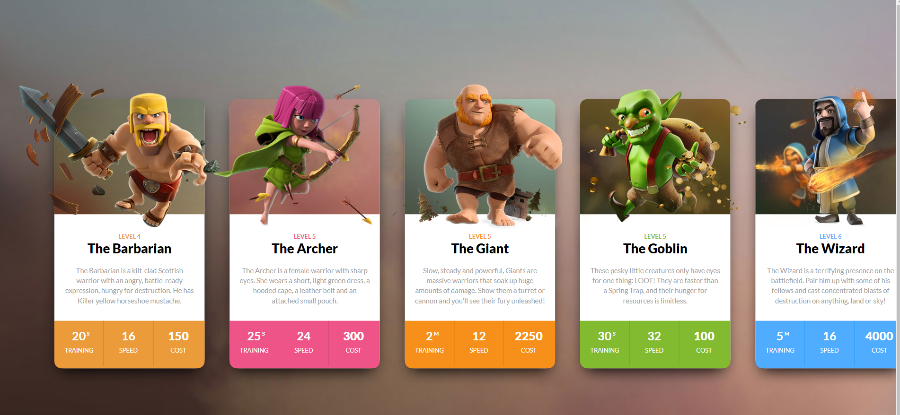

//Applying the background color
const colorArray = ['#EC9B3B', '#EE5487', '#F6901A', '#82bb30', '#4facff'];

const cards = document.querySelectorAll(".clash-card__unit-stats");
// const cardsArray = Array.from(cards);
// const cardsArray = [...cards];

cards.forEach((card, index) => {
  card.style.backgroundColor = colorArray[index % colorArray.length];
});

//changing text color to white
let cardText = document.querySelectorAll(".one-third");
cardText.forEach(text);

function text (e){
e.style.color = "#ffffff";
};

let cardArray = ['The Barbarian', 'The Archer', "The Giant", 'The Goblin', 'The Wizard'];
let archer = document.querySelector('.clash-card__level.clash-card__level--archer + div');
// archer.innerText = 'The Archer';
archer.innerText = cardArray[1];

const goblin = document.querySelector('.clash-card__level--goblin + div');
goblin.innerText = cardArray[3];

