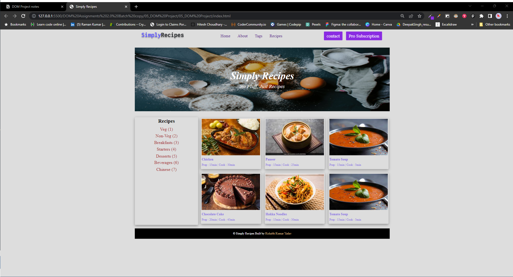

//to add Pro Subscription
let parentElement = document.querySelectorAll('.nav-center div:nth-child(3) a')[0];
let cloneElement = parentElement.cloneNode(true);
cloneElement.innerText = "Pro Subscription";
// parentElement.appendChild(cloneElement);
parentElement.insertAdjacentElement('afterend', cloneElement);

// to add Chinese(7)

let receipe = document.querySelector('.tags-container div a:last-child');
let duplicateNode = receipe.cloneNode(true);
duplicateNode.textContent = "Chinese (7)";
receipe.insertAdjacentElement('afterend', duplicateNode);

//to change the color of the text in card
let textColor = document.querySelectorAll('.recipe-name, .recipe-disp');
// textColor.style.color = "blue";
textColor.forEach((e)=> {
e.style.color = "#8A6FE2";
});

// to your Name at footer
let footerName = document.querySelector('.page-footer p a');
footerName.innerText = "Rishabh Kumar Yadav"

// to add 6h card

//to make a clone
let sixthCard = document.querySelectorAll('.card')[2];
let clonecard = sixthCard.cloneNode(true);

let parent = document.querySelector(".recipe-gallery");
parent.appendChild(clonecard);
