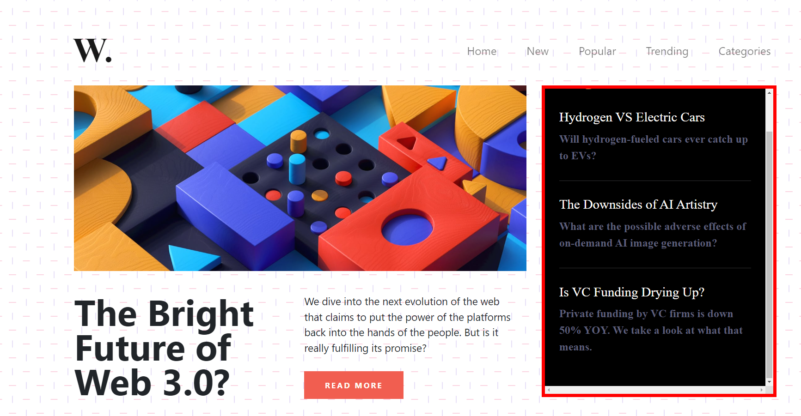
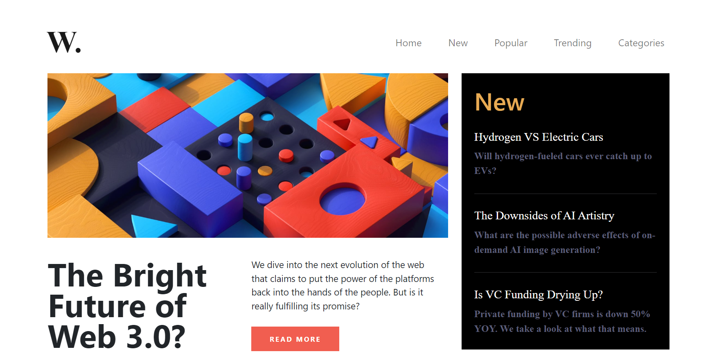
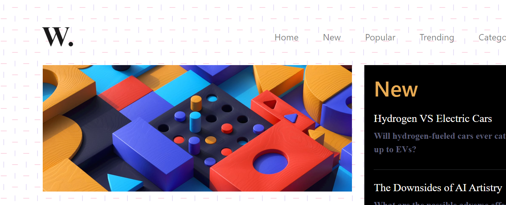

// to make aside scroll

let aside = document.querySelectorAll('.col-lg-4.new')[0];
aside.style.maxHeight = '450px';
aside.style.overflow = 'scroll';
aside.style.border = "5px solid red"

//to hide the scroll bar and to hide the horizontal line
// to hide the scroll bar
aside.style.overflow = 'hidden';
aside.style.border = 'none'

// to hide the body lines
let colorLines = document.querySelector('body');
colorLines.style.backgroundImage = 'none';

//restore backgroundImage 
colorLines.style.backgroundImage = '';

//to show the navbar vertically in small screen
const navbarToggler = document.querySelector('.collapse');
navbarToggler.style.display = "flex";
