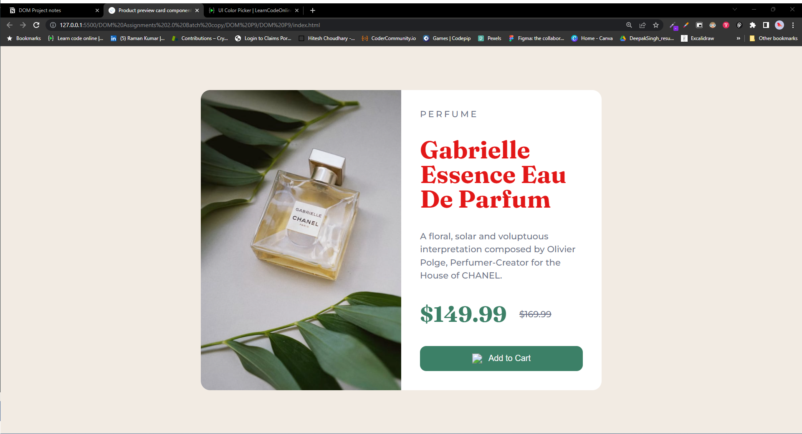
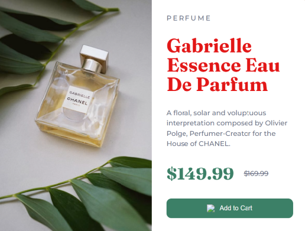

//to change the colorto red of class "title"

let gabriellePerfume = document.querySelector('.caption h1');
gabriellePerfume.style.color = "#E21717";

let button = document.querySelector('.add-to-cart');

button.addEventListener('mouseenter', changeColor);
button.addEventListener('mouseleave', Color);

function changeColor() {
    gabriellePerfume.style.color = "black";
    button.style.backgroundColor = "#E21717";
};

function Color() {
    gabriellePerfume.style.color = "#B4161B";
    button.style.backgroundColor = "#1C8D73";
};
